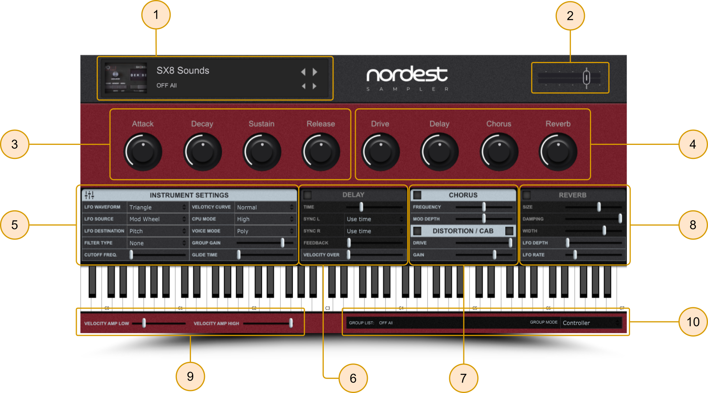
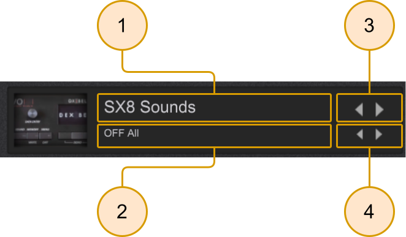
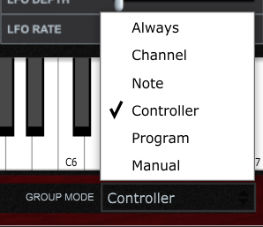

# Conhecendo a interface

O [Nordest Sampler](https://www.youtube.com/watch?v=_G5LDz5CN1I) possui uma estrutura muito fácil e simples de ser utilizada e programada ao seu gosto, conforme a sua necessidade. Todas as configurações disponíveis para o plugin estão sendo mostradas em sua totalidade na interface gráfica de abertura do mesmo, sendo possível assim acessar qualquer um dos seus recursos de maneira muito rápida.

Nesta imagem, listado em seções numéricas, temos todas as funcionalidades disponíveis para uso no Nordest Sampler:

**Seções do Nordest Sampler:**

* [**01. Sound List**](#01_sound_list)
* [**02. Master Volume**](#02_master_volume)
* [**03. Sound Modify**](#03_sound_modify)
* [**04. FX Mixer**](#04_fx_mixer)
* [**05. Instrument Settings**](#05_instrument_settings)
* [**06. Delay**](#06_delay)
* [**07. Chorus/Distortion**](#07_chorus_-_distortioncab)
* [**08. Reverb**](#08_reverb)
* [**09. Velocity Amp**](#09_veloticy_amp)
* [**10. Group List/Mode**](#10_group_listmode)

Nos próximos tópicos, traremos diversas informações completas sobre cada uma dessas Seções e como os seus ajustes podem afetar diretamente o som do seu instrumento virtual durante sua performance ou produção musical.

## 01. Sound List

Nesta seção nós temos a exibição de timbres e módulos sonoros, com controles de NEXT/PREV para ambos.
Aqui nós temos alguns controles básicos, onde cada um deles representa exatamente:

- [x]   **Module View:** uma tela que mostra o nome do módulo de sons que está selecionado;
- [x]   **Group View (Instrument View):** uma tela que mostra o som do módulo selecionado que está ativo;
- [x]   **Module NEXT/PREV:** navega entre os módulos de sons ou expansões de samples disponíveis dentro do plugin;
- [x]   **Sound NEXT/PREV:** navega entre os grupos ou instrumentos de cada módulo que estiver selecionado.

## 02. Master Volume

Como o próprio nome já diz, este botão é dedicado a controlar o volume de saída geral de áudio dentro do Nordest Sampler

## 03. Sound Modify

Nesta seção você tem acesso aos parâmetros básicos de modulação das amostras:

- [x]   **Attack**: altera o volume de entrada do som;
- [x]   **Decay:** altera tempo que a nota vai levar para decair o áudio;
- [x]   **Sustain:** altera o tempo que o som se mantém após ser acionado o Decay;
- [x]   **Release:** altera o tempo em que a nota vai durar após soltar as teclas/Pedal de sustain.

## 04. FX Mixer

Nesta seção você tem um acesso de controle rápido de mixagem para os seguintes efeitos:

- [x]   **Drive:** aumenta a distorção sonora no som, gerada pelo efeito Distortion/Cab;
- [x]   **Delay:** aumenta o efeito do plugin delay, gerado dentro do Nordest Sampler;
- [x]   **Chorus:** aumenta o efeito gerado pelo efeito de chorus do plugin;
- [x]   **Reverb:** aumenta o efeito de reverberação que o plugin de reverb trás.

## 05. Instrument Settings

Nesta seção você vai encontrar ajustes avançados para controlar ajustes de LFO para o módulo de sons selecionado.
Dentre os parâmetros a seguir, vamos explicar passo a passo como cada um deles funciona:

- [x]   **LFO Waveform:** É o controle responsável por escolher o tipo de onda que o oscilador vai usar paracontrole de LFO do som.

- [x]   **LFO Source:** É o controle responsável por escolher qual tipo de parâmetro MIDI vai controlar oefeito gerado via LFO, jutamente da WAVEFORM.

- [x]   **LFO Destination:** Este controle diz para onde vai o sinal LFO gerado, em conjunto com com oparâmetro MIDI que foi determinado na seção acima.

- [x]   **Filter Type:** Escolhe o tipo de filtro de CUTOFF sonora que será usado no plugin.

- [x]   **Cutoff Freq:** Determina a região de frequência em que o filtro de CUTOFF vai começar a atuar.

- [x]   **Veloticy Curve:** Como o próprio nome sugere, este menu disponibiliza alguns ajustes de veloticy que se adaptamà sua necessidade.

- [x]   **CPU Mode:** Este controle é responsável por otimizar o processamento da instância aberta deste plugin. Você pode ajustar de acordo com a sua preferência, tendo em vista que em alguns casos isto irá impactar diretamente no seu som, mesmoque de forma imperceptível.

- [x]   **Voice Mode:** Controla a forma como as wavs se comportam, sendo elas em mono monofônico, polifônico ou glide.

- [x]   **Group Gain:** Este controle é responsável por controlar o ganho de volume apenas do grupo/instrumento selecionadodentro do módulo de sons que estiver aberto no momento, não afetando de forma geral o volume dos demais grupos/instrumentos.

- [x]   **Glide Time:** Se o VOICE MODE estiver em mono ou glide, este parâmetro irá controlar a velocidade de "ligadura" queo efeito terá entre uma nota e outra. É muito semelhante a controles em plugins de Synths e outros.

## 06. Delay

Esta seção vai controlar todos os parâmetros disponíveis para o efeito de Delay que se encontra dentro do Nordest Sampler.
Abaixo estão listados todos os parâmetros:

- [x]   **Toggle ON/OFF:** Este botão liga e desliga o efeito;

- [x]   **Time:** Determina a velocidade que o efeito irá usar para se repetir, em milisegundos;

- [x]   **Sync L/R** Determina a velocidade que o efeito se repetirá, seguindo o BPM que está definido dentro da sua DAW;

- [x]   **Feedback:** Determina o número de repetições que o efeito de delay terá após ser iniciado;

- [x]   **Veloticy Over**: Determina o volume que os serão tocados no geral. Se estiver completamente para a esquerda, o somirá soar de forma padrão. Se estiver completamente para esquerda, tudo será tocado como se estivesse no veloticy máximo;

## 07. Chorus - Distortion/Cab

Nesta seção você tem acesso aos controles destinados aos efeitos de chorus, distorção e cabinet simulator.
Abaixo estão listados todos os parâmetros:

- [x]   **Toggle ON/OFF:** Estes 3 botões ligam e desligam os efeitos desta seção;

!!! info "Informação importante"

    Um dos controles **Toggle ON/OFF** liga ou desliga o efeito de Cab Simulator ou Cabinet. Este controle simula um som gerado por um amplificador de guitarra, e funciona em formato de áudio **MONO**, ao habilitar este efeito certifique-se de que o seu som estará sendo mudado para **MONO** e você irá notar que haverá uma diferença notória.

- [x]   **Frequency:** Este controle ajusta a velocidade que o chorus irá operar;
- [x]   **Mod Depth:** Este controle ajusta a quantidade de modulação de pitch que o chorus vai gerar no som;
- [x]   **Drive:** Este controle vai determinar a quantidade de distorção harmônica sobre o som dos instrumentos;
- [x]   **Gain:** Este controel regula a quantidade de ganho de sinal gerado pelo Drive Distortion/Cabinet.

## 08. Reverb

Nesta seção você tem acesso aos controles destinados ao efeito de Reverb do Nordest Sampler.
Abaixo estão listados todos os parâmetros:

- [x]   **Toggle ON/OFF:** Este botão liga e desliga o efeito de Reverb;
- [x]   **Size:** Este botão regula a duração do efeito de reverb, popularmente conhecido como tamanho ou size;
- [x]   **Damping:** Este botão vai determinar a dispersação de frequências altas;

!!! example "Exemplo de uso do Damping"

    Para entender melhor este controle, basta fazer uso dele em suas extremindades, ele completamente para a esquerda, serão audíveis todas as frequências agudas, ele completamente para a direita, serão dispersas com mais rapidez as frequências agudas, trazendo assim a característica de um Reverb mais Dark no seu som.

- [x]   **Width:** Este controle regula a abertura stereo do efeito de Reverb no som;
- [x]   **LFO Rate:** Este controle não está relacionado ao reverb, mas sim aos controles avançados da aba [Instrument Settings](#05-instrument-settings), e tem o propósito de regular a velocidade do LFO que gera sinais como trêmolo, auto pan e outros;
- [x]   **LFO Depth:** Este controle também está relacionado aos parâmetros de LFO da aba [Instrument Settings](#05-instrument-settings), o qual regula exatamente a intensidade do efeito gerado pelo LFO.

## 09. Veloticy Amp

Nesta seção temos somente 2 controles fundamentais, sendo eles:

- [x]   **Veloticy Amp Low:** Este controle faz com que seja amplificado o volume das notas com veloticy mais fraco, trazendo-o mais acima se estiver todo para a direita ou deixando soar mais baixo enquanto estiver para a esquerda.
- [x]   **Veliticy Amp High:** Este controle faz com que sejam amplificado o volume das notas com veloticy mais forte, se estiver todo para a direita soará com o volume padrão, se estiver todo para a esquerda soará ainda mais alto do que o nível padrão de 0db.

!!! danger "CUIDADO!"

    Ao abusar de forma demasiada do controle **Veloticy Amp High** o seu som pode acabar saindo completamente saturado, fazendo assim com que todo o seu trabalho seja em vão na hora de trazer mais volume, mais "punch" ou "peso" ao seu som.

## 10. Group List/Mode

Nesta seção nós temos dois controles básicos, sendo eles os seguintes:

- [x] **Group List:** Dedica-se a mostrar o grupo que está ativo ou selecionar um grupo de forma manual;
- [x] **Group Mode:** Este controle muda a forma como o grupo atual poderá ser selecionado, entre diversos tipos de comandos MIDI.

Vale lembrar que o controle de Group Mode ou Group Selection precisa estar devidamente configurado, de acordo com as opções mostradas na imagem abaixo:

Como podemos ver, há diversas opções disponíveis para seleção dos grupos dentro desta lista, e a seguir explicaremos exatamente como cada uma delas funciona:

* **Always:** Esta forma de seleção faz com que o determinado grupo fique sempre ativo;
* **Channel:** Esta forma de seleção faz com que o grupo seja selecionado de acordo com um canal MIDI;
* **Note:** Esta forma de seleção faz com que o grupo seja selecionado de acordo com uma nota do teclado;
* **Controller:** Esta forma de seleção faz com que o grupo seja selecionado de acordo com um controle MIDI.

!!! info "Como utilizar este recurso"

    Para trocar os timbres via MIDI CC você precisa usar o controle CC 0, também conhecido como **"Bank Select"**.
    Através de DAW's com o Ableton Live, ou qualquer outra que leia este comando MIDI você pode efetuar a troca do timbre, ou definindo o controle em algum botão do seu controlador.

* **Program:** Esta forma de seleção faz com que o determinado grupo seja selecionado de acordo com o controle de **"Program Change"**, muito conhecido e disponível em qualquer equipamento MIDI;
* **Manual:** Este forma de seleção faz com que o determinado grupo só esteja ativo de forma manual, para isto você pode ativá-lo através do controle de Group List ou através dos controles de **NEXT/PREV** dos grupos/instrumentos, disponíveis na aba de [Sound List](#01_sound_list).

!!! danger "CUIDADO"

    Por conta de algumas DAW's terem certos bugs quanto ao funcionamento via MIDI de comandos como estes, os modos mais recomendados para se utilizar são apenas os modos de Controller, Always, Channel e Manual.

